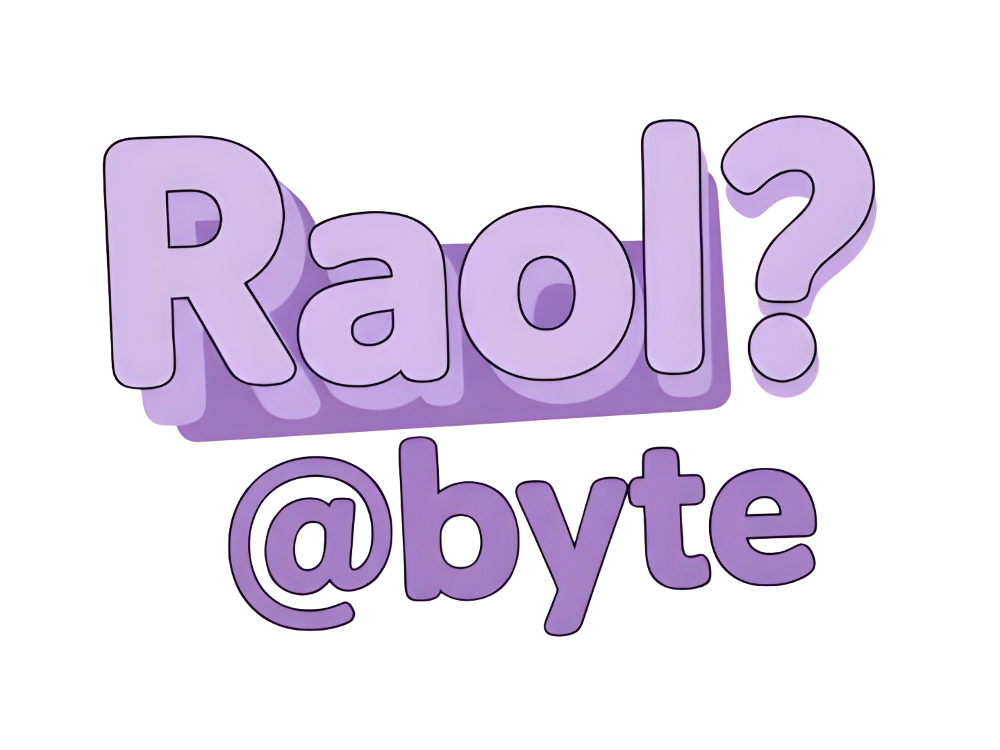

<div align="center">
  
  
  #  Hi, I'm RaolByte
  
  <p>
    <em>A passionate student developer from Indonesia</em><br>
    <em>Fueled by matcha lattes and cat cuddles 🍵 🐱</em>
  </p>
</div>

##  Tech Stack

<div align="center">
  
</div>

##  Wakatime Stats

<!--START_SECTION:waka-->

```txt
Total Time: 12 hrs 36 mins

JavaScript     6 hrs 27 mins   ⣿⣿⣿⣿⣿⣿⣿⣿⣿⣿⣿⣿⣷⣀⣀⣀⣀⣀⣀⣀⣀⣀⣀⣀⣀   51.26 %
PHP            2 hrs 28 mins   ⣿⣿⣿⣿⣷⣀⣀⣀⣀⣀⣀⣀⣀⣀⣀⣀⣀⣀⣀⣀⣀⣀⣀⣀⣀   19.59 %
CoffeeScript   1 hr 29 mins    ⣿⣿⣿⣀⣀⣀⣀⣀⣀⣀⣀⣀⣀⣀⣀⣀⣀⣀⣀⣀⣀⣀⣀⣀⣀   11.77 %
Go             55 mins         ⣿⣷⣀⣀⣀⣀⣀⣀⣀⣀⣀⣀⣀⣀⣀⣀⣀⣀⣀⣀⣀⣀⣀⣀⣀   07.35 %
Markdown       47 mins         ⣿⣦⣀⣀⣀⣀⣀⣀⣀⣀⣀⣀⣀⣀⣀⣀⣀⣀⣀⣀⣀⣀⣀⣀⣀   06.30 %
coffee         13 mins         ⣦⣀⣀⣀⣀⣀⣀⣀⣀⣀⣀⣀⣀⣀⣀⣀⣀⣀⣀⣀⣀⣀⣀⣀⣀   01.73 %
TypeScript     9 mins          ⣤⣀⣀⣀⣀⣀⣀⣀⣀⣀⣀⣀⣀⣀⣀⣀⣀⣀⣀⣀⣀⣀⣀⣀⣀   01.20 %
JSON           6 mins          ⣄⣀⣀⣀⣀⣀⣀⣀⣀⣀⣀⣀⣀⣀⣀⣀⣀⣀⣀⣀⣀⣀⣀⣀⣀   00.80 %
```

<!--END_SECTION:waka-->
